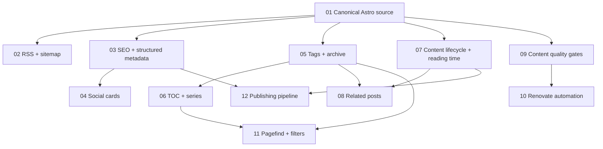

# Roadmap — v2.1 Publishing platform foundation

**Mode:** brownfield / standard
**Delivery:** sequential isolated PRs from latest `main`

## Dependency map

| Phase | Goal | Requirements | Blocked by | Status |
| --- | --- | --- | --- | --- |
| 01 | Make Markdown + one dynamic Astro route the only article source; remove generated/legacy artifacts | CORE-01..05 | — | complete |
| 02 | Publish valid RSS and sitemap discovery endpoints | FEED-01..04 | 01 | complete |
| 03 | Add canonical, OpenGraph/Twitter completeness and BlogPosting JSON-LD | SEO-01..05 | 01 | complete |
| 04 | Generate deterministic per-article social preview cards | OG-01..04 | 03 | complete |
| 05 | Turn tags into navigable taxonomy and add chronological archive | TAX-01..05 | 01 | complete |
| 06 | Add article TOC/heading anchors and ordered series navigation | UX-01..05 | 05 | planned |
| 07 | Add draft/publish/update lifecycle and automatic reading time | LIFE-01..06 | 01 | planned |
| 08 | Recommend related posts deterministically from taxonomy/series | REL-01..04 | 05,07 | planned |
| 09 | Add durable content-quality checks to PR CI | QUAL-01..06 | 01 | planned |
| 10 | Add Renovate dependency/action update automation compatible with CI | DEP-01..05 | 09 | planned |
| 11 | Add Pagefind static search plus tag/year filters when useful | SEARCH-01..06 | 05,06 | planned |
| 12 | Build a canonical-content syndication/export pipeline for DEV, LinkedIn, newsletters and future adapters | PUB-01..10 | 03,07 | planned |

## Phase exit criteria

### 01 — Canonical Astro source
- all posts render from `src/content/blog/*.md` through one dynamic route/layout;
- no committed `dist/` or generated legacy HTML remains;
- old build/generate/test scripts are removed or explicitly retained with a current purpose;
- README/AGENTS describe the actual architecture;
- adding a Markdown post requires no generated `.astro` page.

### 02 — RSS + sitemap
- `/blog/rss.xml` is produced from published posts with canonical links;
- sitemap is generated from Astro routes and respects the `/blog` base path;
- feed/sitemap URLs are discoverable from page metadata where appropriate;
- build/CI verifies both outputs exist.

### 03 — SEO + structured metadata
- canonical URL, `og:url`, description and Twitter equivalents are emitted consistently;
- article publication/update timestamps and tags are represented where available;
- valid `BlogPosting` JSON-LD is emitted for articles;
- absolute URLs are used for canonical/social metadata.

### 04 — Social cards
- every article can resolve a deterministic 1200x630 social image from metadata;
- card generation is build-time/static and does not require a hosted image service;
- text wrapping/escaping handles long Spanish technical titles;
- default/fallback card remains available.

### 05 — Tags + archive
- tags link to stable `/tags/<slug>/` pages;
- `/tags/` lists available taxonomy with counts;
- `/archive/` groups published content chronologically;
- tag normalization avoids duplicate URLs for case/spacing variants.

### 06 — TOC + series
- article headings expose stable anchors with copyable deep links;
- long posts can render a TOC derived from headings;
- frontmatter supports optional ordered series metadata;
- series pages/navigation expose previous/next without duplicating article source.

### 07 — Content lifecycle + reading time
- schema supports draft, publish date and optional update date;
- drafts/future-dated posts are excluded from production listing/routes/feed/search;
- dev mode can still preview draft content through an explicit path/flag if practical;
- reading time is derived from source rather than manually maintained.

### 08 — Related posts
- article pages show a small deterministic related-content set;
- scoring prefers same series, then shared normalized tags, then recency;
- no recommendation points to drafts/current article;
- behavior is deterministic and tested/build-verified.

### 09 — Content quality gates
- PR CI checks build/security plus frontmatter/content invariants;
- broken internal links and missing local assets are detected;
- Markdown/style checks avoid high-noise rules;
- generated Mermaid support remains validated by the normal build.

### 10 — Renovate automation
- npm packages and GitHub Actions are updated through Renovate PRs;
- grouping/auto-merge policy is conservative and documented;
- no major update auto-merges;
- PRs rely on the repository CI gate before merge.

### 11 — Pagefind + filters
- static client-side search indexes only published content;
- search works under the `/blog` base path and is usable on mobile;
- tag/year filtering composes with search without external services;
- the no-JS browsing path remains usable for normal navigation.

### 12 — Publishing pipeline
- Markdown remains canonical and external channel state is metadata/provenance, not copied article files;
- pipeline can build reviewable channel payloads without credentials (`--dry-run`/export);
- DEV adapter supports canonical URL semantics through its supported API;
- LinkedIn path uses supported API when configured, otherwise produces a manual-ready payload;
- newsletter is provider-neutral first, with adapters added only for documented supported APIs;
- platform-specific copy can be explicit frontmatter overrides or deterministic generated defaults;
- credentials never enter repository content/logs;
- retries/idempotency prevent accidental duplicate publication;
- merge does not automatically cross-post by default;
- docs explain provider capability/limitations and manual fallbacks.

## Milestone exit

A new article can be authored once as Markdown, validated before merge, rendered through a single route, discovered via RSS/sitemap/search/taxonomy, shared with correct social/SEO metadata, navigated through related/series structures, and exported or explicitly syndicated to supported channels while the canonical blog remains authoritative.
