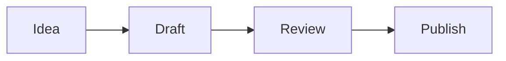

## Repository contract

This is an Astro 7 static blog deployed to GitHub Pages. Markdown in `src/content/blog/*.md` is the canonical article source.

Every article is rendered by the single dynamic route `src/pages/posts/[slug].astro` through `src/layouts/PostLayout.astro`. Do not create article-specific `.astro` pages or commit generated output from `dist/`.

Before changing architecture or milestone scope, read:

- `.planning/PROJECT.md`
- `.planning/REQUIREMENTS.md`
- `.planning/ROADMAP.md`
- `.planning/STATE.md`

GitHub Issues track operational work; `.planning/` owns requirements, ordering, and implementation contracts.

## Development

Use the repository's Node.js 22+ contract and lockfile:

```bash
npm ci
npm run dev
npm run build
npm audit --audit-level=high
```

Dependency changes must keep `package-lock.json` in sync and preserve `npm ci`.

Pull requests to `main` must pass `.github/workflows/ci.yml`. Changes that affect generated pages or assets must also be checked after merge through the GitHub Pages deployment workflow.

## Content and diagrams

Create posts only as Markdown files under `src/content/blog/`. A new Markdown post must not require a new Astro article page.

Mermaid diagrams are supported with standard fenced code blocks:

````markdown

````

Use Mermaid when a diagram communicates structure, flow, state, architecture, sequence, or relationships more clearly than prose. Do not turn simple lists or short explanations into diagrams just for decoration.

Preferred diagram types include `flowchart`, `sequenceDiagram`, `stateDiagram-v2`, `classDiagram`, `erDiagram`, `gitGraph`, and `timeline`. Keep diagrams small enough to remain readable on mobile; split very large diagrams instead of shrinking them excessively.

Accessibility and content rules:

- Explain the important conclusion of a diagram in nearby prose. A diagram must not be the only place where essential information appears.
- Use meaningful node labels and avoid relying only on color to communicate meaning.
- Avoid raw HTML or JavaScript in Mermaid labels. Rendering uses Mermaid with `securityLevel: 'strict'`.
- Keep Mermaid source in the Markdown article; do not commit generated SVGs when Mermaid can express the diagram cleanly.
- Do not add per-post Mermaid scripts, CDN imports, or custom renderers. Mermaid is integrated centrally through `astro-mermaid` in `astro.config.mjs`.
- Mermaid is rendered client-side only on pages that contain Mermaid blocks; normal Markdown/code fences continue through Astro's standard pipeline.
- Keep `astro-mermaid` and `mermaid` compatible. `astro-mermaid@2.1.0` declares Mermaid 10/11 support, so Mermaid is intentionally pinned to `11.17.2`. Do not upgrade to Mermaid 12+ until the integration supports it and existing diagrams have been validated.

## Social preview cards

- Article cards are generated from the canonical Content Collection at `/og/<slug>.png`; non-article pages use `/og/default.png`.
- Do not commit generated PNGs or add a hosted/runtime OG-image service.
- Keep cards exactly 1200x630 and update `scripts/validate-social-cards.mjs` with any contract change.
- Content-derived strings must stay XML-escaped and long titles must remain bounded; do not bypass `src/lib/social-card.mjs` with per-post card templates.
- Keep system fonts disabled. The renderer intentionally uses pinned `@resvg/resvg-js` with fonts from pinned `@fontsource/inter` so CI output does not depend on runner-installed fonts.
- `npm run build` must continue verifying card coverage, dimensions, metadata references and deterministic stress rendering.

## Taxonomy and archive

- Tags in frontmatter are canonical display labels; their URLs are derived only through `src/lib/taxonomy.mjs`.
- Do not hand-author tag slugs or duplicate tag registries. Use `tagSlug()`, `buildTaxonomy()` and `TagLink.astro`.
- Case, whitespace and accent differences must resolve predictably; symbol handling for values such as `CI/CD`, `C++` and `R&D` is covered by the build validator.
- A new article/tag must automatically appear in `/tags/`, its matching `/tags/<slug>/` page, the home links, the archive and sitemap without a manual list edit.
- Keep `scripts/validate-taxonomy.mjs` aligned with any taxonomy/archive contract change.

## Article navigation and series

- Use the `headings` returned by Astro's `render(entry)`; do not parse Markdown again to build article TOCs.
- Astro-generated heading IDs are the canonical deep-link IDs. TOC links must match those IDs exactly.
- The visible heading permalink enhancement must stay framework-free and progressively enhance existing server-rendered heading IDs.
- Show the article TOC only when the shared threshold is met; keep it collapsible and mobile-usable.
- Series metadata is optional and must use `series: { id, name, order }`. The id is a stable lowercase URL slug and order is a positive integer.
- Use `src/lib/series.mjs` for grouping, order and previous/next context. Do not hand-author series registries or copied article lists.
- Duplicate order or inconsistent names inside one series are build errors.
- Keep `scripts/validate-article-ux.mjs` aligned with any heading/TOC/series contract change.

## Content lifecycle

- `src/lib/content-lifecycle.mjs` is the single publication contract. Do not reimplement draft/future filtering in individual pages.
- Public routes, home, RSS, social cards, taxonomy, archive and series must consume `getPublishedPosts()` before deriving their outputs.
- Publication dates are validated `YYYY-MM-DD` calendar dates and public eligibility uses the `Europe/Madrid` calendar day, not the CI runner's UTC date.
- `draft` defaults to `false`; both drafts and future-dated entries must be absent from all production outputs and must not affect tag counts or series previous/next navigation.
- Draft/future preview is allowed only through the explicit development route `/preview/<slug>/`. Production builds must not generate a preview tree.
- Reading time comes from canonical `CollectionEntry.body` through `readingTimeForPost()`. Never add or restore manual `readingTime` frontmatter.
- Keep `scripts/validate-lifecycle.mjs` and generated-output validators aligned with lifecycle changes. When changing filtering, test both a draft and a future-dated entry across the complete production output.

## Related posts

- `src/lib/related-posts.mjs` is the only recommendation-ranking contract. Do not duplicate scoring logic in layouts/components.
- Candidate posts must pass the shared lifecycle filter and the current article must always be excluded.
- Ranking is lexicographic and intentionally has no arbitrary weights: same series first, then shared normalized tag count, then publication recency, then slug as the final deterministic tie-break.
- Shared tags are compared through the same `tagSlug()` normalization used by taxonomy.
- Keep the default rendered result bounded to three unless the product requirement changes deliberately.
- `RelatedPosts.astro` may explain the relation to readers, but presentation labels must not change ranking.
- Keep `scripts/validate-related-posts.mjs` aligned with ranking changes and preserve fixtures proving draft/future exclusion and deterministic tie-breaking.
- Article-heading validation must stay scoped to `data-post-body`; headings from surrounding UI components are not Markdown content headings.

## Generated output and legacy code

- Never commit `dist/` or copies of generated site HTML/CSS/PNG assets.
- Static source assets belong in `public/`; build-generated pages/cards do not.
- Do not reintroduce the retired custom build/generate scripts.
- External publishing/syndication belongs to Phase 12 of the v2.1 roadmap. Do not add unofficial browser scraping, session reuse, placeholder API integrations, or automatic cross-posting on merge.

## Documentation

Use the official Astro documentation for routing, content collections, components, and styling, Mermaid documentation for diagram syntax, and the pinned renderer/font package documentation for social-card generation.
