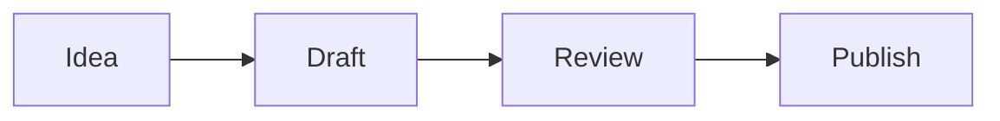

## Repository contract

This is an Astro 7 static blog deployed to GitHub Pages. Markdown in `src/content/blog/*.md` is the canonical article source.

Every article is rendered by the single dynamic route `src/pages/posts/[slug].astro` through `src/layouts/PostLayout.astro`. Do not create article-specific `.astro` pages or commit generated output from `dist/`.

Before changing architecture or milestone scope, read:

- `.planning/PROJECT.md`
- `.planning/REQUIREMENTS.md`
- `.planning/ROADMAP.md`
- `.planning/STATE.md`

GitHub Issues track operational work; `.planning/` owns requirements, ordering, and implementation contracts.

## Development

Use the repository's Node.js 22+ contract and lockfile:

```bash
npm ci
npm run dev
npm run build
npm audit --audit-level=high
```

Dependency changes must keep `package-lock.json` in sync and preserve `npm ci`.

Pull requests to `main` must pass `.github/workflows/ci.yml`. Changes that affect generated pages must also be checked after merge through the GitHub Pages deployment workflow.

## Content and diagrams

Create posts only as Markdown files under `src/content/blog/`. A new Markdown post must not require a new Astro page.

Mermaid diagrams are supported with standard fenced code blocks:

````markdown

````

Use Mermaid when a diagram communicates structure, flow, state, architecture, sequence, or relationships more clearly than prose. Do not turn simple lists or short explanations into diagrams just for decoration.

Preferred diagram types include `flowchart`, `sequenceDiagram`, `stateDiagram-v2`, `classDiagram`, `erDiagram`, `gitGraph`, and `timeline`. Keep diagrams small enough to remain readable on mobile; split very large diagrams instead of shrinking them excessively.

Accessibility and content rules:

- Explain the important conclusion of a diagram in nearby prose. A diagram must not be the only place where essential information appears.
- Use meaningful node labels and avoid relying only on color to communicate meaning.
- Avoid raw HTML or JavaScript in Mermaid labels. Rendering uses Mermaid with `securityLevel: 'strict'`.
- Keep Mermaid source in the Markdown article; do not commit generated SVGs when Mermaid can express the diagram cleanly.
- Do not add per-post Mermaid scripts, CDN imports, or custom renderers. Mermaid is integrated centrally through `astro-mermaid` in `astro.config.mjs`.
- Mermaid is rendered client-side only on pages that contain Mermaid blocks; normal Markdown/code fences continue through Astro's standard pipeline.
- Keep `astro-mermaid` and `mermaid` compatible. `astro-mermaid@2.1.0` declares Mermaid 10/11 support, so Mermaid is intentionally pinned to `11.17.2`. Do not upgrade to Mermaid 12+ until the integration supports it and existing diagrams have been validated.

## Generated output and legacy code

- Never commit `dist/` or copies of generated site HTML/CSS.
- Static source assets belong in `public/`; generated pages do not.
- Do not reintroduce the retired custom build/generate scripts.
- External publishing/syndication belongs to Phase 12 of the v2.1 roadmap. Do not add unofficial browser scraping, session reuse, placeholder API integrations, or automatic cross-posting on merge.

## Documentation

Use the official Astro documentation for routing, content collections, components, and styling, and Mermaid documentation for diagram syntax.
