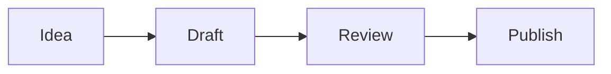

## Development

When starting the dev server, use background mode:

```
astro dev --background
```

Manage the background server with `astro dev stop`, `astro dev status`, and `astro dev logs`.

## Content and diagrams

Blog posts are authored as Markdown in the Astro content collection. Mermaid diagrams are supported with standard fenced code blocks:

````markdown

````

Use Mermaid when a diagram communicates structure, flow, state, architecture, sequence, or relationships more clearly than prose. Do not turn simple lists or short explanations into diagrams just for decoration.

Preferred diagram types include `flowchart`, `sequenceDiagram`, `stateDiagram-v2`, `classDiagram`, `erDiagram`, `gitGraph`, and `timeline`. Keep diagrams small enough to remain readable on mobile; split very large diagrams instead of shrinking them excessively.

Accessibility and content rules:

- Always explain the important conclusion of a diagram in nearby prose. A diagram must not be the only place where essential information appears.
- Use meaningful node labels and avoid relying only on color to communicate meaning.
- Avoid raw HTML or JavaScript in Mermaid labels. Rendering uses Mermaid with `securityLevel: 'strict'`.
- Keep the Mermaid source in the Markdown article; do not commit generated SVGs for diagrams that can be expressed cleanly in Mermaid.
- Do not add per-post Mermaid scripts or CDN imports. Rendering is handled centrally by `src/layouts/Layout.astro`.
- Mermaid is loaded only on pages that contain a Mermaid code fence. If the renderer cannot load or a diagram is invalid, the original code block remains as a readable fallback.
- The current renderer is pinned to Mermaid `11.17.2`. Upgrade it deliberately and validate existing diagrams before changing the pinned version.

Astro syntax highlighting deliberately excludes the `mermaid` language in `astro.config.mjs`; normal code fences continue to use Shiki.

## Documentation

Full documentation: https://docs.astro.build

Consult these guides before working on related tasks:

- [Adding pages, dynamic routes, or middleware](https://docs.astro.build/en/guides/routing/)
- [Working with Astro components](https://docs.astro.build/en/basics/astro-components/)
- [Using React, Vue, Svelte, or other framework components](https://docs.astro.build/en/guides/framework-components/)
- [Adding or managing content](https://docs.astro.build/en/guides/content-collections/)
- [Adding styles or using Tailwind](https://docs.astro.build/en/guides/styling/)
- [Supporting multiple languages](https://docs.astro.build/en/guides/internationalization/)
- [Mermaid syntax and diagram types](https://mermaid.js.org/intro/)
