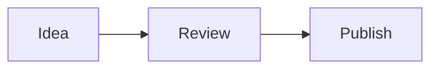

# Sergio Valverde Blog

Personal technical blog built with Astro and deployed as a static site to GitHub Pages.

## Architecture

- **Astro 7** builds the static site.
- **Astro Content Collections** load and validate canonical articles from `src/content/blog/*.md`.
- **One public article route** (`src/pages/posts/[slug].astro`) renders only published content.
- **Content lifecycle** is centralized in `src/lib/content-lifecycle.mjs`: drafts and future-dated posts are excluded from every public surface using the Europe/Madrid calendar day.
- **Development preview** is explicit at `/blog/preview/<slug>/` and is not generated in production.
- **Reading time** is calculated automatically from `CollectionEntry.body`; it is not stored in frontmatter.
- **@astrojs/rss** and **@astrojs/sitemap** publish discovery data from public content/routes.
- **Tag taxonomy** normalizes frontmatter tags to stable `/blog/tags/<slug>/` routes.
- **Chronological archive** exposes `/blog/archive/`.
- **Article navigation** uses Astro-generated heading IDs for TOCs and deep links.
- **Optional series metadata** drives ordered series pages and previous/next navigation.
- **Static social cards** are prerendered as deterministic 1200x630 PNGs.
- **astro-mermaid** renders Mermaid fences in Markdown.
- **GitHub Actions** validates pull requests and deploys `main` to GitHub Pages.

Markdown is the canonical article source. Generated output such as `dist/`, search indexes and generated social-card PNGs must not be committed.

## Structure

```text
src/
├── components/
│   ├── PostCard.astro
│   └── TagLink.astro
├── content/blog/              # Canonical Markdown articles
├── content.config.ts          # Frontmatter/lifecycle schema
├── lib/
│   ├── content-lifecycle.mjs  # Publication filtering + reading time
│   ├── series.mjs             # Series ordering/navigation
│   ├── social-card.mjs        # Deterministic SVG -> PNG renderer
│   └── taxonomy.mjs           # Tag normalization + post ordering
├── layouts/
│   ├── Layout.astro
│   └── PostLayout.astro
└── pages/
    ├── index.astro
    ├── about.astro
    ├── archive.astro
    ├── rss.xml.js
    ├── posts/[slug].astro
    ├── preview/[slug].astro   # Development only
    ├── tags/
    │   ├── index.astro
    │   └── [tag].astro
    ├── series/
    │   ├── index.astro
    │   └── [series].astro
    └── og/
        ├── default.png.ts
        └── [slug].png.ts

scripts/
├── lib/generated-posts.mjs
├── validate-lifecycle.mjs
├── validate-discovery.mjs
├── validate-social-cards.mjs
├── validate-seo.mjs
├── validate-taxonomy.mjs
└── validate-article-ux.mjs
```

## Writing an article

Create `src/content/blog/<slug>.md`:

```yaml
---
title: "My Post Title"
description: "Short description"
date: "2026-09-18"
updatedDate: "2026-09-20" # optional; cannot be before date
draft: false              # optional; defaults to false
tags: ["AI", "GitHub"]
featured: false
# Optional series:
# series:
#   id: "agentic-development"
#   name: "Desarrollo agéntico"
#   order: 1
---
```

Dates must be real `YYYY-MM-DD` calendar dates. A post is publicly generated only when `draft !== true` and its publication date is not later than the current calendar day in `Europe/Madrid`.

Do **not** add `readingTime`: the article page derives it from the Markdown body automatically.

A published post automatically participates in its public route, home, RSS, sitemap, social card, taxonomy, archive and series navigation. Draft and future-dated entries must not influence any of those surfaces.

### Previewing drafts/future posts

Run:

```bash
npm run dev
```

Then open:

```text
http://localhost:4321/blog/preview/<slug>/
```

The preview route is intentionally development-only and displays a visible preview banner. Production builds do not generate `/preview/`.

## Mermaid diagrams

Use normal fenced Markdown:

````markdown

````

Mermaid is integrated centrally; do not add per-post scripts or generated SVGs when Mermaid can express the diagram.

## Local validation

Node.js 22.12 or newer is required.

```bash
npm ci
npm run dev
npm run build
npm audit --audit-level=high
```

`npm run build` validates lifecycle/reading-time behavior, RSS/sitemap discovery, generated social cards, canonical/OG/Twitter/JSON-LD metadata, taxonomy/archive consistency, heading/TOC parity and deterministic series behavior.

## Pull requests and deployment

Pull requests to `main` run:

1. `npm ci`
2. `npm audit --audit-level=high`
3. `npm run build`

A push to `main` builds and deploys ignored `dist/` output through GitHub Pages Actions.

## Publishing roadmap

The canonical source remains this blog. External syndication/export is intentionally deferred to the v2.1 publishing phase so mutation remains explicit, reviewable and canonical-URL preserving.
