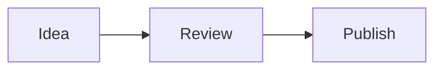

# Sergio Valverde Blog

Personal technical blog built with Astro and deployed as a static site to GitHub Pages.

## Architecture

- **Astro 7** builds the static site.
- **Astro Content Collections** load and validate canonical articles from `src/content/blog/*.md`.
- **One public article route** (`src/pages/posts/[slug].astro`) renders only published content.
- **Content lifecycle** is centralized in `src/lib/content-lifecycle.mjs`: drafts and future-dated posts are excluded from every public surface using the Europe/Madrid calendar day.
- **Development preview** is explicit at `/blog/preview/<slug>/` and is not generated in production.
- **Reading time** is calculated automatically from `CollectionEntry.body`; it is not stored in frontmatter.
- **@astrojs/rss** and **@astrojs/sitemap** publish discovery data from public content/routes.
- **Tag taxonomy** normalizes frontmatter tags to stable `/blog/tags/<slug>/` routes.
- **Chronological archive** exposes `/blog/archive/`.
- **Article navigation** uses Astro-generated heading IDs for TOCs and deep links.
- **Optional series metadata** drives ordered series pages and previous/next navigation.
- **Related posts** are selected deterministically from published content: same series, then shared normalized tags, then recency, with slug as the final tie-break.
- **Static social cards** are prerendered as deterministic 1200x630 PNGs.
- **astro-mermaid** renders Mermaid fences in Markdown.
- **Content quality gate** checks source structure plus generated internal links, anchors, local assets and completed-phase outputs without opinionated prose linting.
- **Pagefind static search** indexes only published article HTML after the Astro build, with tag/year filters and a search UI at `/blog/search/`.
- **Renovate policy** covers npm + GitHub Actions with conservative grouping; auto-merge is explicitly disabled while `main` has no enforced protection/status checks.
- **Publishing pipeline** derives deterministic DEV, LinkedIn and newsletter payloads from canonical Markdown; dry-run/export is network-free and API mutation is explicit.
- **GitHub Actions** validates pull requests and deploys `main` to GitHub Pages.

Markdown is the canonical article source. Generated output such as `dist/`, search indexes and generated social-card PNGs must not be committed.

## Structure

```text
src/
├── components/
│   ├── PostCard.astro
│   ├── RelatedPosts.astro
│   └── TagLink.astro
├── content/blog/              # Canonical Markdown articles
├── content.config.ts          # Frontmatter/lifecycle schema
├── lib/
│   ├── content-lifecycle.mjs  # Publication filtering + reading time
│   ├── related-posts.mjs      # Deterministic recommendation ranking
│   ├── series.mjs             # Series ordering/navigation
│   ├── social-card.mjs        # Deterministic SVG -> PNG renderer
│   └── taxonomy.mjs           # Tag normalization + post ordering
├── layouts/
│   ├── Layout.astro
│   └── PostLayout.astro
└── pages/
    ├── index.astro
    ├── about.astro
    ├── archive.astro
    ├── rss.xml.js
    ├── search.astro              # Pagefind Component UI + no-JS fallback navigation
    ├── posts/[slug].astro
    ├── preview/[slug].astro   # Development only
    ├── tags/
    │   ├── index.astro
    │   └── [tag].astro
    ├── series/
    │   ├── index.astro
    │   └── [series].astro
    └── og/
        ├── default.png.ts
        └── [slug].png.ts

scripts/
├── lib/
│   ├── generated-posts.mjs
│   ├── provenance.mjs
│   ├── publishing-core.mjs
│   ├── publishing-providers.mjs
│   └── source-article.mjs
├── publish.mjs
├── validate-content-quality.mjs
├── validate-lifecycle.mjs
├── validate-discovery.mjs
├── validate-social-cards.mjs
├── validate-seo.mjs
├── validate-taxonomy.mjs
├── validate-article-ux.mjs
├── validate-related-posts.mjs
├── validate-search.mjs
├── validate-publishing.mjs
└── validate-renovate-config.mjs
```

## Writing an article

Create `src/content/blog/<slug>.md`:

```yaml
---
title: "My Post Title"
description: "Short description"
date: "2026-09-18"
updatedDate: "2026-09-20" # optional; cannot be before date
draft: false              # optional; defaults to false
tags: ["AI", "GitHub"]
featured: false
# Optional series:
# series:
#   id: "agentic-development"
#   name: "Desarrollo agéntico"
#   order: 1
---
```

Dates must be real `YYYY-MM-DD` calendar dates. A post is publicly generated only when `draft !== true` and its publication date is not later than the current calendar day in `Europe/Madrid`.

Do **not** add `readingTime`: the article page derives it from the Markdown body automatically.

A published post automatically participates in its public route, home, RSS, sitemap, social card, taxonomy, archive and series navigation. Draft and future-dated entries must not influence any of those surfaces.

### Previewing drafts/future posts

Run:

```bash
npm run dev
```

Then open:

```text
http://localhost:4321/blog/preview/<slug>/
```

The preview route is intentionally development-only and displays a visible preview banner. Production builds do not generate `/preview/`.

## Mermaid diagrams

Use normal fenced Markdown:

````markdown

````

Mermaid is integrated centrally; do not add per-post scripts or generated SVGs when Mermaid can express the diagram.

## Local validation

Node.js 22.12 or newer is required.

```bash
npm ci
npm run dev
npm run build
npm audit --audit-level=high
```

`npm run build` runs the real Astro build, generates the Pagefind index, and then validates source structure, generated internal links/anchors, local assets, completed-phase outputs, Mermaid transformation, lifecycle/reading-time behavior, RSS/sitemap discovery, social cards, canonical/OG/Twitter/JSON-LD metadata, taxonomy/archive consistency, heading/TOC parity, deterministic series behavior, related-post ranking/rendering, search index scope/configuration and the publishing pipeline safety/idempotency contract.

### Static search

The production search lives at `/blog/search/`. Pagefind is generated from `dist/` after Astro finishes, and only article pages marked with `data-pagefind-body` enter the index.

Search results carry title, description, tags, year and date metadata. Tag and year filters are generated statically by Pagefind; the browser does not call an external search service.

Because the Pagefind bundle only exists after a production build, test the real search locally with:

```bash
npm run build
npm run preview
```

The search page still exposes normal links to Tags and Archive when JavaScript is unavailable.

### Content quality rules

The structural gate is intentionally small and objective:

- every article must have delimited frontmatter with one `title` and one `date`;
- article bodies cannot be empty;
- Markdown articles must not add a `# H1` because the shared layout already owns the page H1;
- fenced code blocks must close;
- generated internal links and hash anchors must resolve;
- generated local images/scripts/styles/icons/preloads must exist;
- completed public outputs such as RSS/sitemap/default OG card must exist;
- Mermaid fences must still be transformed by the normal Astro + `astro-mermaid` build.

It deliberately does not score prose, sentence length, tone or wording.

### Dependency automation

`renovate.json` is the repository-owned Renovate contract:

- managers are limited to `npm` and `github-actions`;
- Dependency Dashboard is enabled;
- routine releases age for 3 days before update PRs;
- patch and minor updates are grouped separately per manager;
- major updates stay explicit/manual and receive a `major-update` label;
- update noise is capped at 2 PRs/hour and 5 concurrent PRs;
- `automerge` and `platformAutomerge` are both disabled.

Auto-merge is intentionally disabled because GitHub currently reports `main` as unprotected with no enforced required status checks. The permanent `scripts/validate-renovate-config.mjs` gate rejects attempts to silently enable auto-merge while that is true.

The configuration has been validated with Renovate CLI itself and its local extraction detects both `package.json` and the GitHub Actions workflows. Actual hosted update PRs still require the Renovate GitHub App to have access to this repository.

## Pull requests and deployment

Pull requests to `main` run:

1. `npm ci`
2. `npm audit --audit-level=high`
3. `npm run build`

A push to `main` builds and deploys ignored `dist/` output through GitHub Pages Actions.

## Publishing and syndication

Markdown remains canonical. The publishing CLI reads the same source article and generates deterministic channel payloads without copying article content into provider-specific source files.

The safe default is a network-free dry-run:

```bash
npm run publish -- --slug use-contribute-fork-build
```

Reviewable exports are also network-free:

```bash
npm run publish -- --slug use-contribute-fork-build --export-dir publication-exports
```

Network mutation is never implicit. It requires one explicit API-backed channel plus `--publish`:

```bash
npm run publish -- --slug use-contribute-fork-build --channel dev --publish
npm run publish -- --slug use-contribute-fork-build --channel linkedin --publish
```

There is no publish-all mode and no force flag to bypass provenance/idempotency. Successful API publication records a credential-free channel/slug fingerprint and external ID/URL in `data/publication-provenance.json`; subsequent publication of the same channel + slug is blocked.

DEV uses the supported Forem v1 article API and preserves the blog canonical URL. LinkedIn uses the supported Posts API only when runtime OAuth/author/version configuration is present; dry-run/export always provides manual-ready copy and there is no browser/session scraping fallback. Newsletter output is provider-neutral until a documented provider API/connector is deliberately selected.

Provider details, environment variables, frontmatter overrides and safety rules are documented in [`docs/publishing.md`](docs/publishing.md).
