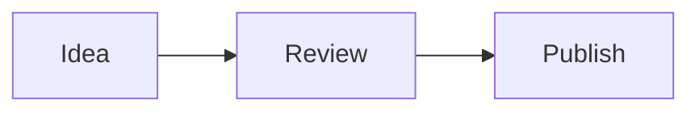

# Sergio Valverde Blog

Personal technical blog built with Astro and deployed as a static site to GitHub Pages.

## Architecture

- **Astro 7** builds the static site.
- **Astro Content Collections** load and validate articles from `src/content/blog/*.md`.
- **One dynamic route** (`src/pages/posts/[slug].astro`) renders every article. Adding a post does not require a new `.astro` page.
- **@astrojs/rss** generates `/blog/rss.xml` directly from the canonical content collection.
- **@astrojs/sitemap** generates sitemap discovery output from the built Astro routes.
- **Static social cards** are prerendered as 1200x630 PNGs from article metadata; no hosted OG-image service is used.
- **astro-mermaid** renders Mermaid fences in Markdown; Mermaid is pinned to a compatible v11 release.
- **GitHub Actions** validates pull requests and deploys `main` to GitHub Pages.

Markdown is the canonical article source. Generated output such as `dist/` and generated social-card PNGs are never committed.

## Structure

```text
src/
├── content/blog/          # Canonical Markdown articles
├── content.config.ts      # Content collection schema
├── lib/
│   └── social-card.mjs    # Deterministic SVG -> PNG renderer
├── layouts/
│   ├── Layout.astro       # Site shell, canonical/OG/Twitter/JSON-LD
│   └── PostLayout.astro   # Shared article presentation
└── pages/
    ├── index.astro
    ├── about.astro
    ├── rss.xml.js
    ├── og/
    │   ├── default.png.ts
    │   └── [slug].png.ts
    └── posts/[slug].astro

scripts/
├── validate-discovery.mjs
├── validate-social-cards.mjs
└── validate-seo.mjs

.github/workflows/
├── ci.yml
└── deploy.yml
```

## Writing an article

Create `src/content/blog/<slug>.md` with frontmatter such as:

```yaml
---
title: "My Post Title"
description: "Short description"
date: "2026-09-17"
tags: ["AI", "GitHub"]
featured: false
readingTime: "5"
---
```

Then write the article directly in Markdown. Do not add a page under `src/pages/posts/`; the dynamic route creates `/blog/posts/<slug>/` during the Astro build.

The same canonical metadata also drives RSS and the article's generated `/blog/og/<slug>.png` social card. Frontmatter tags are links, not display-only labels: they are normalized once through `src/lib/taxonomy.mjs` and exposed through `/blog/tags/`, `/blog/tags/<slug>/` and the chronological `/blog/archive/`. Astro's own rendered heading metadata drives article TOCs, and optional series metadata creates `/blog/series/<id>/` plus article previous/next navigation. Article cards include title, date, tags and site identity; long titles are wrapped/truncated deterministically. Non-article pages use `/blog/og/default.png`.

Mermaid diagrams use normal fenced blocks:

````markdown

````

## Local development

Node.js 22.12 or newer is required.

```bash
npm ci
npm run dev
npm run build
npm audit --audit-level=high
```

`npm run build` verifies RSS/sitemap discovery, generated social-card PNG dimensions/coverage/determinism, canonical/OG/Twitter/JSON-LD metadata, normalized tag counts/membership, chronological archive ordering, heading/TOC parity and deterministic series behavior. The production build is written to ignored `dist/` output.

## Pull requests and deployment

Pull requests to `main` run CI with:

1. `npm ci`
2. `npm audit --audit-level=high`
3. `npm run build`

A push to `main` builds and deploys the generated `dist/` directory through GitHub Pages Actions.

## Publishing roadmap

The canonical source remains this blog. External syndication/export is intentionally not implemented by ad-hoc scripts; the v2.1 roadmap in `.planning/` will introduce a reviewable, provider-aware publishing pipeline in Phase 12.
