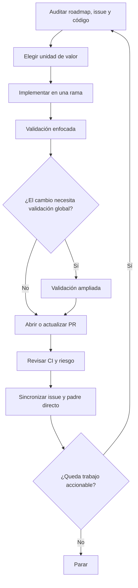

Durante los últimos días he estado probando hasta dónde puede llegar un agente de desarrollo cuando deja de trabajar en tareas aisladas y empieza a recorrer un roadmap de forma autónoma.

El experimento acabó siendo bastante más largo de lo previsto y, en realidad, ocurrió en **dos tiradas distintas**.

La primera duró **unas 14 horas**, hasta que Codex se cayó y la aplicación terminó cerrándose. Después lo volví a arrancar y la segunda tirada llegó a **1 día, 19 horas, 55 minutos y 12 segundos**.

Sumando ambas, fueron **casi 58 horas acumuladas de ejecución**. La cifra total es aproximada porque la primera tirada rondó las 14 horas; la segunda sí quedó registrada por el temporizador.

Al revisar correctamente los dos días de calendario que cubrió el experimento, el panel de uso muestra **869 millones de tokens el 21 de septiembre** y **1.033,4 millones el 22**. En conjunto son **1.902,4 millones de tokens**, aproximadamente **1,9 mil millones**, entre ambos días.

En GitHub ocurre algo parecido: aparecen **746 contribuciones el 21 de septiembre** y **1.259 el 22**, es decir, **2.005 contribuciones entre ambos días**.

Son cifras llamativas, pero no son la conclusión del experimento. Tampoco las interpreto como una medida directa de productividad: el contador de tiempo no equivale necesariamente a tiempo de cómputo efectivo, los tokens del panel no permiten atribuir cada unidad a una operación concreta del loop y el contador de contribuciones de GitHub tampoco mide valor entregado.

Lo realmente interesante apareció al revisar **cómo había trabajado el agente durante tantas horas**.

## El experimento

El objetivo era relativamente sencillo: dejar que Codex avanzase por un roadmap real con la menor intervención posible.

El entorno tenía cuatro piezas principales:

- **GPT-5.6 Luna en High** como modelo de trabajo.
- **GSD** para organizar el trabajo alrededor de issues y roadmap.
- **Engram** como memoria para conservar contexto entre pasos.
- Un **goal abierto** que indicaba a Codex que continuase avanzando mientras hubiese trabajo accionable.

En ese momento todavía no había una skill específica que definiese cómo debía recorrer ese proceso.

El agente podía inspeccionar el backlog, seleccionar trabajo, modificar código, ejecutar pruebas, abrir pull requests, revisar CI, actualizar issues y crear nuevos tickets cuando encontraba trabajo adicional.

En otras palabras, no estaba probando si Codex podía implementar una función concreta. Estaba probando algo bastante más incómodo:

**qué ocurre cuando dejas que un agente tome cientos de pequeñas decisiones operativas durante muchas horas.**

## El primer problema: un agente puede ser demasiado disciplinado

Una de las primeras cosas que aparecieron fue un número excesivo de micro-PRs.

El agente tendía a interpretar cada pieza técnica como una unidad de trabajo independiente. Un contrato, una capa de persistencia, un pequeño wiring o una integración podían terminar separados aunque solo tuviesen sentido como parte de una misma capacidad.

Desde un punto de vista local, muchas de esas decisiones eran defendibles. Cada PR era pequeña, fácil de revisar y tenía validación propia.

El problema aparecía al observar el sistema completo.

**La disciplina estaba generando overhead.**

Más ramas, más PRs, más ciclos de CI, más sincronización de issues y más trabajo administrativo para entregar algo que conceptualmente seguía siendo una única funcionalidad.

Esto me llevó a una regla que ahora considero mucho más importante:

> **Una PR debería representar una unidad de valor o una unidad de revisión independiente, no simplemente una unidad técnica pequeña.**

Si contrato, persistencia, runtime wiring y tests pertenecen al mismo comportamiento y no necesitan ownership, rollback o revisión independiente, separarlos puede empeorar el flujo en lugar de mejorarlo.

## El segundo problema: validar todo también tiene un coste

Otro patrón fue la tendencia a ejecutar validaciones muy amplias incluso después de cambios pequeños.

Tener tests es imprescindible para trabajar de forma autónoma. De hecho, sin una buena red de validación probablemente no dejaría un agente recorrer un roadmap durante horas.

Pero eso no significa que cada modificación deba disparar siempre la batería más cara de comprobaciones locales.

El flujo que me parece más razonable es progresivo:

1. Ejecutar primero los **tests enfocados** al comportamiento modificado.
2. Ejecutar **build o typecheck** del paquete o servicio afectado.
3. Aplicar lint, formato y comprobaciones específicas sobre los archivos modificados.
4. Reservar las validaciones globales para los puntos donde realmente aportan información adicional.

El objetivo no es hacer menos testing. Es evitar que el agente repita comprobaciones costosas que no cambian significativamente la confianza sobre el cambio.

## El tercer problema: la trazabilidad también puede convertirse en burocracia

Mantener issues padres actualizados, documentar decisiones, enlazar PRs y conservar el estado del roadmap funcionó bien.

Pero, de nuevo, apareció un límite.

Si cada pequeño cambio técnico obliga a actualizar varios niveles del roadmap, el sistema empieza a gastar una parte significativa de su tiempo describiendo su propio trabajo.

Eso es especialmente peligroso con agentes porque pueden ejecutar esta burocracia con una consistencia casi perfecta.

Un proceso innecesariamente pesado para una persona suele resultar molesto. Para un agente autónomo puede convertirse en **burocracia automática a escala**.

La solución que estoy probando es sincronizar siempre el padre directo y propagar información a otros niveles solo cuando exista una decisión, dependencia o riesgo que realmente los afecte.

## Lo que sí funcionó

La retrospectiva no fue una lista de problemas. Hubo varias decisiones que quiero mantener.

### GitHub CLI como interfaz principal

Trabajar con **`gh` CLI** resultó una interfaz muy eficaz para issues, pull requests y estado del repositorio.

Para este tipo de loop prefiero una herramienta determinista y fácilmente verificable antes que depender de automatización de navegador. MCP sigue siendo útil cuando aporta una capacidad que no existe de otra forma, pero no veo razón para utilizar una capa adicional cuando la CLI ya resuelve bien la operación.

### Decisiones explícitas

Cuando aparecía una duda importante, el agente registraba la pregunta, las alternativas consideradas y la decisión tomada bajo un marcador común.

Esto permitió continuar trabajando sin detener el loop por cada incertidumbre y, al mismo tiempo, dejó un rastro que puedo revisar después.

La autonomía sin registro de decisiones es difícil de auditar. La autonomía con demasiada ceremonia también es ineficiente. El punto interesante está entre ambas.

### Separar los fallos propios de los externos

También funcionó bien distinguir entre:

- un fallo provocado por el cambio actual;
- un fallo previo del repositorio;
- un problema externo de CI o infraestructura.

El agente debía corregir lo primero. Lo segundo debía quedar documentado. Y lo tercero podía justificar un nuevo issue si requería trabajo independiente.

Parece una distinción pequeña, pero evita uno de los peores comportamientos posibles en un loop largo: empezar a reparar cosas no relacionadas solo porque aparecen rojas durante la ejecución.

### Límites de alcance

Mantener explícito qué estaba dentro y fuera de cada unidad de trabajo ayudó a evitar que una tarea creciese indefinidamente.

Esto sigue siendo necesario incluso cuando agrupamos más cambios en una misma PR. Agrupar no significa permitir scope creep.

## La conclusión más importante: no existe un único workflow agentic

Al terminar la revisión apareció algo más importante que cualquiera de las optimizaciones anteriores.

Yo estaba intentando definir **un único proceso de trabajo autónomo** y eso era parte del problema.

Un side project y un entorno enterprise no optimizan las mismas cosas.

| Proyecto personal o equipo pequeño | Entorno enterprise |
| --- | --- |
| Reducir overhead | Maximizar trazabilidad cuando importa |
| Agrupar trabajo relacionado | Separar cambios con riesgo o rollback independiente |
| Avanzar rápido por el roadmap | Mantener evidencia de decisiones y validaciones |
| Crear issues solo cuando aportan valor | Conservar límites de ownership, riesgo y auditoría |
| Optimizar tiempo y coste del loop | Optimizar control, explicabilidad y reversibilidad |

En un proyecto personal, crear cinco PRs donde una sería suficiente es desperdicio.

En un entorno enterprise, juntar en una sola PR dos cambios con riesgos, responsables o estrategias de rollback diferentes puede ser exactamente el error contrario.

Por eso terminé separando el proceso en dos skills.

## `personal-agentic-delivery`

La primera está orientada a proyectos personales y equipos pequeños.

Su objetivo es que el agente pueda continuar por el roadmap de forma autónoma, pero agrupando cambios relacionados en **PRs conceptuales** y evitando generar ceremonias que no aportan capacidad de revisión real.

La prioridad es avanzar manteniendo suficiente contexto, tests, decisiones y trazabilidad para poder revisar el trabajo después.

## `enterprise-agentic-delivery`

La segunda mantiene una disciplina más estricta cuando existe una razón para ello.

Aquí una unidad pequeña puede justificar una PR independiente si tiene su propio límite de seguridad, riesgo operacional, migración, rollback, compliance o necesidad de auditoría.

El objetivo no es crear más burocracia porque el proyecto sea grande. Es hacer explícito **qué fricción compra una garantía real**.

Las dos skills quedaron registradas en el repositorio de skills y la PR que recoge este cambio ya está fusionada:

[PR #83: personal-agentic-delivery y enterprise-agentic-delivery](https://github.com/svg153/skills/pull/83)

## Cómo plantearía ahora un loop autónomo

Después de este experimento, mi flujo base sería algo parecido a esto:

Hay tres decisiones dentro de ese flujo que me parecen especialmente importantes:

**1. Elegir la unidad de valor antes de tocar código.**

No asumir que un issue existente equivale necesariamente al tamaño correcto de una PR.

**2. Validar de forma proporcional.**

La confianza debe crecer con el riesgo y el alcance del cambio, no con una regla fija aplicada a todo.

**3. Tener una condición de parada.**

Un agente que siempre puede encontrar algo más que mejorar no tiene realmente un roadmap. Tiene una búsqueda infinita de trabajo.

## Lo que todavía no sé

Este experimento me ha dado mejores reglas, pero no demuestra todavía que el nuevo proceso sea más eficiente.

Quiero medir en próximos loops al menos:

- número de PRs por capacidad entregada;
- tiempo dedicado a validación;
- reintentos de CI;
- issues creados frente a issues realmente necesarios;
- tokens consumidos por unidad de trabajo;
- decisiones que requieren corrección humana posterior.

Solo entonces podré saber si las nuevas skills reducen realmente coste y tiempo o simplemente producen un workflow que me resulta conceptualmente más limpio.

Esa distinción importa.

## Dejar trabajar al agente no es la parte difícil

Después de **casi 58 horas acumuladas en dos tiradas**, mi conclusión no es que necesitemos agentes capaces de permanecer activos todavía más tiempo.

Eso llegará casi por inercia a medida que mejoren los modelos, las herramientas y la memoria.

El problema interesante es otro:

**diseñar el sistema de trabajo que permita al agente saber cuándo avanzar, cuándo agrupar, cuándo validar y cuándo parar.**

Porque aumentar la autonomía sin revisar el proceso no elimina la burocracia.

Puede simplemente conseguir que la burocracia se ejecute mucho más rápido.

Si también estás dejando agentes recorrer roadmaps durante horas, me interesa especialmente qué controles has terminado manteniendo y cuáles has eliminado después de verlos funcionar en proyectos reales.
