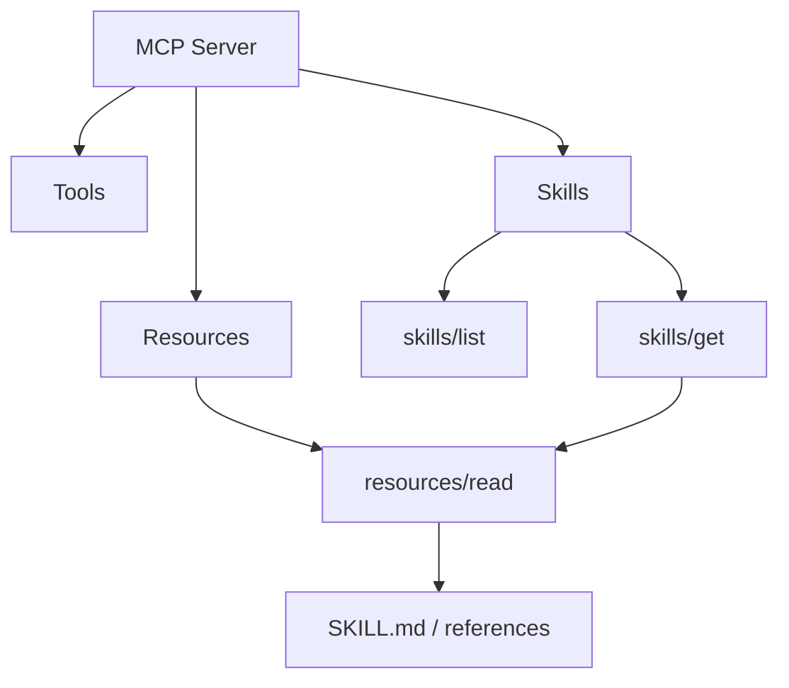
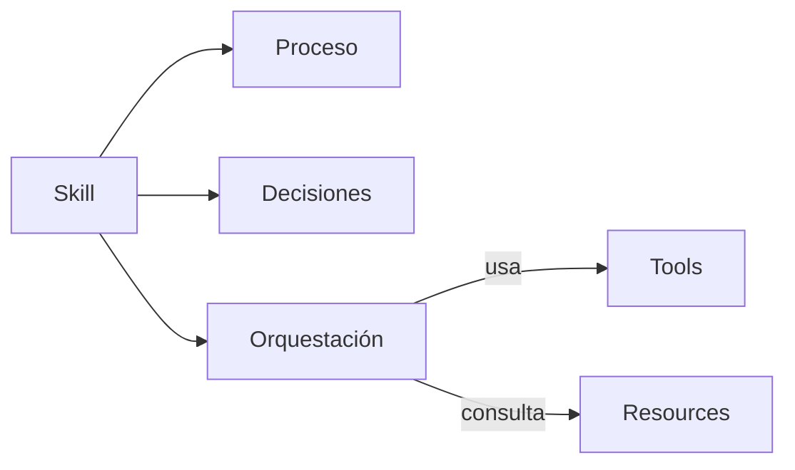
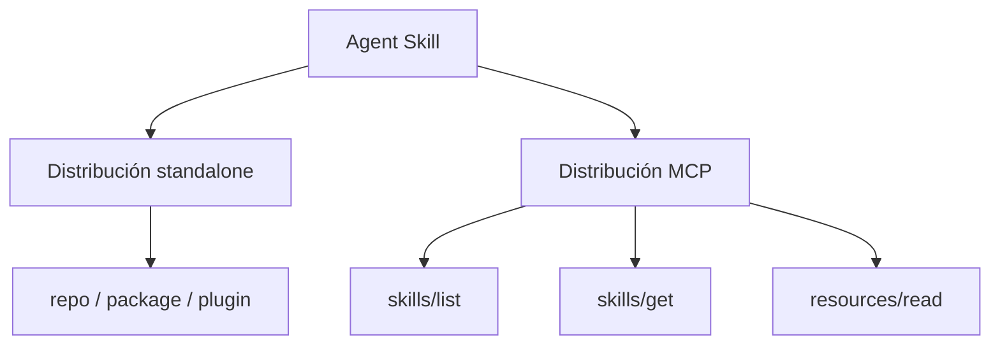
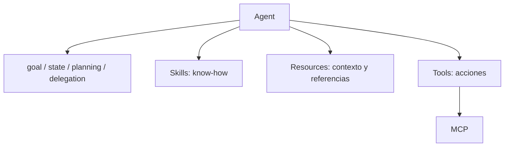

Durante mucho tiempo hemos explicado MCP con una idea bastante sencilla: conectar un agente con las capacidades de un servicio.

Un servidor publica herramientas. El cliente las descubre. El modelo decide cuándo utilizarlas.

Eso resolvía una parte importante del problema, pero dejaba otra bastante menos visible: **tener acceso a una herramienta no implica saber utilizarla correctamente dentro de un proceso**.

Con **SEP-2640, Skills Extension**, MCP empieza a cubrir precisamente esa distancia. La propuesta fue marcada como Final, aceptada por los Core Maintainers y mergeada el 13 de septiembre de 2026. La documentación oficial ya describe cómo un servidor MCP puede exponer Agent Skills para que el cliente las descubra y cargue bajo demanda.

La forma corta de explicarlo sería:

> Las tools dicen qué puedes hacer. Las Skills pueden explicar cómo conseguir un objetivo utilizando esas capacidades.

Pero las consecuencias arquitectónicas son bastante más interesantes.

## El problema de tener muchas tools

Imaginemos un MCP Server para GitHub.

Puede ofrecer operaciones para buscar pull requests, consultar commits, leer issues, inspeccionar repositorios, recuperar ficheros o modificar elementos de un proyecto.

Eso es muy útil, pero no responde por sí mismo a una petición como:

> Encuentra todas mis contribuciones relevantes durante este año.

Para resolverla bien puede ser necesario:

1. resolver la identidad del usuario;
2. buscar pull requests;
3. buscar commits e issues relevantes;
4. gestionar paginación;
5. normalizar resultados de fuentes diferentes;
6. deduplicar elementos;
7. aplicar criterios de relevancia;
8. presentar evidencias y enlaces.

Ninguna de esas operaciones aisladas representa el objetivo completo.

Crear otra tool llamada `find_all_my_contributions` podría funcionar para ese caso concreto, pero repetir ese patrón termina convirtiendo el servidor en una colección de endpoints cada vez más especializados.

Otra opción es conservar tools relativamente primitivas y distribuir junto a ellas el **know-how para orquestarlas**.

Ahí encajan las Skills.

## Qué estandariza Skills over MCP

La documentación oficial define una extensión denominada `io.modelcontextprotocol/skills`.

Un servidor que la soporta puede anunciar Skills y debe implementar dos operaciones específicas:

- `skills/list`, para descubrir las Skills disponibles;
- `skills/get`, para recuperar la entrada de una Skill por URI.

Los contenidos reales de la Skill (`SKILL.md` y sus archivos auxiliares) se leen utilizando el primitive de Resources existente, mediante `resources/read`.

Esto es importante porque MCP **no inventa un nuevo formato de Skill**. La Skill sigue el formato de Agent Skills: un directorio con `SKILL.md` y, opcionalmente, referencias u otros archivos de apoyo.

MCP estandariza el mecanismo para descubrirla y recuperarla remotamente.

Además, el cliente no tiene que descargar todas las instrucciones al conectarse. `skills/list` puede devolver nombre, descripción y manifiesto, y el host carga el contenido únicamente cuando lo necesita.

Es progressive disclosure aplicado al conocimiento operacional.

## Tools, Resources y Skills no son lo mismo

Una de las preguntas interesantes es dónde termina un Resource y dónde empieza una Skill.

No creo que la respuesta correcta sea convertir cualquier documentación en una Skill.

Una separación práctica sería:

| Primitive | Pregunta que responde | Ejemplo |
| --- | --- | --- |
| **Tool** | ¿Qué acción puedo ejecutar? | Crear un issue |
| **Resource** | ¿Qué información necesito conocer? | Esquema, metadata o documentación de formato |
| **Skill** | ¿Cómo consigo este objetivo? | Crear correctamente una épica siguiendo un proceso |

Pensemos en Jira.

Atlassian utiliza ADF (Atlassian Document Format) para representar determinado contenido enriquecido. La especificación de ADF es conocimiento de referencia. No hace falta convertir toda esa documentación en una Skill.

Podría exponerse como un Resource.

En cambio, una Skill `create-well-formed-jira-epic` podría describir algo parecido a:

1. inspeccionar el proyecto;
2. determinar el issue type adecuado;
3. obtener los campos requeridos;
4. consultar la referencia de ADF cuando sea necesario;
5. construir la descripción;
6. crear la épica;
7. establecer relaciones;
8. validar el resultado.

La Skill no necesita duplicar toda la documentación de ADF. Puede usarla como referencia durante el proceso.

Eso da una composición mucho más limpia:

## El producto puede enviar también su manual de uso

Aquí aparece el cambio que me parece más importante.

Hasta ahora era fácil pensar en MCP como una capa que adaptaba una API para hacerla utilizable por modelos.

Con Skills over MCP, el propietario del servicio puede publicar también conocimiento operacional específico de ese servicio.

GitHub podría distribuir workflows para operar correctamente sobre sus propias capacidades.

Atlassian podría distribuir Skills que conozcan sus convenciones y procesos.

Una plataforma interna podría proporcionar Skills adaptadas a sus propias políticas, versiones o workflows.

La idea no es que el servidor decida todo por el agente, sino que pueda decirle:

> Estas son mis capacidades y éste es el procedimiento recomendado para combinarlas en determinados objetivos.

El repositorio del Working Group lo resume con una idea muy útil: las descripciones de tools explican qué hace una herramienta, pero no necesariamente cómo orquestar varias tools para conseguir una meta compleja.

## Una Skill puede seguir existiendo fuera del MCP

Skills over MCP no obliga a elegir entre una Skill instalada localmente y una Skill remota.

Éste es un punto relevante para ecosistemas donde ya existen repositorios, gestores de Skills o plugins.

Una estructura razonable puede mantener una única fuente lógica de conocimiento y varios canales de distribución:

Eso permite utilizar una Skill en clientes que todavía no soportan la extensión y, al mismo tiempo, aprovechar discovery y carga bajo demanda cuando sí existe soporte.

La regla que más sentido me parece que tiene es:

> **Author once, distribute many.**

No mantener tres copias divergentes del mismo `SKILL.md`, sino una fuente canónica y distintas formas de entregarla.

## Hay también una dimensión de seguridad y governance

Distribuir instrucciones remotamente introduce preguntas importantes.

SEP-2640 incluye un manifiesto de archivos con hashes SHA-256 y tamaños. El host debe verificar los bytes recibidos antes de utilizarlos y una modificación del manifiesto invalida una aprobación persistente previa.

Eso ayuda a garantizar consistencia entre el manifiesto aprobado y el contenido utilizado.

Pero un hash no demuestra que el servidor sea digno de confianza. Si el servidor es malicioso, puede modificar tanto el contenido como el hash publicado.

Por eso el propio estándar deja claro que los digests proporcionan **consistencia**, no **confianza**.

En entornos enterprise seguirá existiendo espacio para capas adicionales de governance:

- orígenes permitidos;
- aprobación de Skills;
- snapshots o pinning;
- políticas de ejecución;
- auditoría;
- promoción entre entornos;
- restricciones sobre contenido dinámico.

La estandarización del transporte no elimina el problema de supply chain. Lo hace más visible.

## ¿Significa esto que MCP se está convirtiendo en un protocolo de agentes?

Todavía no.

Creo que es importante no mezclar conceptos demasiado pronto.

Una Skill aporta procedimientos y conocimiento reutilizable. Un agente completo suele añadir además estado, objetivo, planificación, memoria, políticas de ejecución, autonomía y, potencialmente, delegación a otros agentes.

Por tanto, hoy modelaría las capas así:

MCP está creciendo como **capability plane** para agentes: puede transportar acciones, contexto y ahora workflows reutilizables.

Eso no significa que deba convertirse automáticamente en el protocolo que defina y distribuya cualquier concepto agéntico.

De hecho, mantener esa separación puede ser una ventaja.

Un hipotético `Jira Planner Agent` podría utilizar:

- las tools del Jira MCP;
- Resources con metadata y documentación;
- Skills como `triage-backlog`, `plan-epic` o `prepare-sprint`;
- y por encima su propio objetivo, estado y comportamiento de planificación.

Las Skills mejoran el sustrato del agente sin tener que convertir la Skill en el agente.

## Qué cambia en la práctica

Para quienes diseñamos MCP Servers, creo que aparece una pregunta nueva.

Antes tendíamos a preguntar:

> ¿Qué endpoint de la API debería convertir en otra tool?

Ahora también deberíamos preguntar:

> ¿Qué objetivos requieren combinar varias tools y qué conocimiento debería viajar junto al servidor para ejecutarlos correctamente?

No todo merece una Skill.

Una operación atómica sigue siendo una buena Tool. Una especificación estable puede ser un buen Resource. Una Skill empieza a tener sentido cuando existe proceso: varios pasos, decisiones, condiciones, referencias y orquestación.

Ése me parece el criterio útil.

## De API access a operational know-how

MCP nació resolviendo una necesidad muy concreta: proporcionar una interfaz común entre modelos y sistemas externos.

Skills over MCP no cambia esa raíz, pero sí amplía lo que puede viajar por esa conexión.

Ya no sólo capacidad de ejecución.

También conocimiento sobre cómo utilizarla.

Y eso puede ser especialmente valioso para productos complejos, plataformas internas y entornos enterprise, donde la dificultad real rara vez consiste en saber que existe un endpoint. La dificultad está en saber **qué secuencia de operaciones es correcta, bajo qué condiciones y respetando qué reglas**.

La idea que me quedo de este cambio es bastante sencilla:

> **No basta con enviar las herramientas. También necesitamos enviar el manual.**

## Referencias

- [MCP: Skills Extension overview](https://modelcontextprotocol.io/extensions/skills/overview)
- [modelcontextprotocol/ext-skills: Skills Over MCP Working Group](https://github.com/modelcontextprotocol/ext-skills)
- [SEP-2640: Skills Extension](https://github.com/modelcontextprotocol/modelcontextprotocol/pull/2640)
- [Agent Skills specification](https://agentskills.io/)
