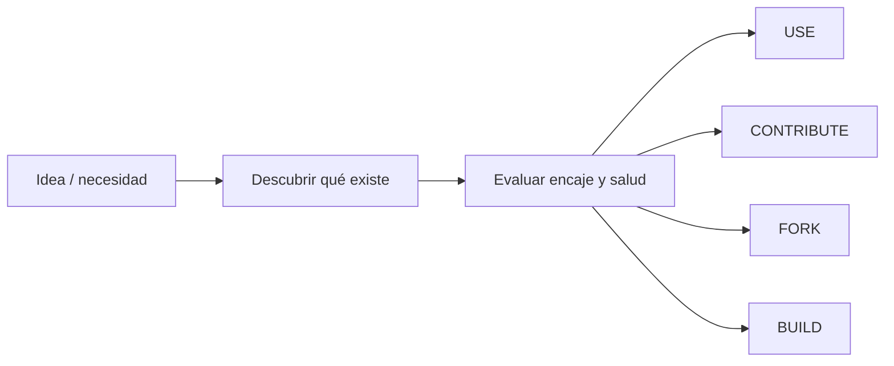

Cuanto mejor programan los agentes, más importante me parece una pregunta que no tiene nada de nueva:

**¿deberíamos construir esto?**

Hace poco volví a pensar en ello a raíz de [`github-repo-scout`](https://github.com/polmarza/github-repo-scout), una skill de Pol Marza que parte de una idea bastante sencilla: antes de empezar a generar código, busca si ya existe algo parecido en GitHub.

Me gustó porque formaliza algo que llevo tiempo metiendo en las instrucciones de mis agentes. Si les pido algo que va más allá de un script pequeño, antes de construir quiero que miren qué existe ya y me ayuden a decidir si tiene más sentido **usarlo, contribuir, hacer un fork o construir algo nuevo**.

La regla no es nueva. “No reinventes la rueda” probablemente sea uno de los consejos más repetidos de la ingeniería de software.

Lo que sí ha cambiado es el coste de ignorarlo.

## Cuando construir empieza a ser más barato que buscar

Antes, empezar una aplicación desde cero tenía bastante fricción. Había que diseñarla, escribir código, montar infraestructura, integrar servicios y dedicar muchas horas antes de llegar a algo mínimamente útil.

Ese coste hacía que buscar una librería, framework o proyecto existente tuviera bastante sentido.

Con los agentes de coding esa relación empieza a cambiar.

Si puedo describir una idea y obtener una primera versión funcional muy rápido, dedicar tiempo a revisar cuatro proyectos, entender sus licencias, comprobar su mantenimiento y estudiar cómo extenderlos puede parecer más lento que decir:

> hazme uno nuevo.

Y ahí aparece una paradoja interesante:

**cuanto más barato resulta generar software, más fácil resulta duplicar software que ya existe.**

Para mí, el flujo debería empezar antes del primer commit.



No se trata de impedir que el agente programe. Se trata de conseguir que **BUILD sea una decisión y no el comportamiento por defecto**.

## El riesgo de fragmentar software a escala

La IA democratiza muchísimo la creación de software, y eso es positivo.

Pero también hace posible que muchas personas resuelvan el mismo problema creando implementaciones independientes que comparten buena parte de la funcionalidad.

El problema no son solo las líneas duplicadas.

Cada nuevo proyecto trae detrás otras responsabilidades:

- dependencias y actualizaciones;
- vulnerabilidades;
- tests y CI;
- documentación;
- releases;
- observabilidad;
- auditabilidad;
- compatibilidad;
- soporte;
- gobernanza y comunidad.

El coste inicial del código es solo una parte del coste de vida del software.

Por eso cada vez me interesa menos la pregunta de si un agente **puede** crear una aplicación completa. Muchas veces puede.

La pregunta interesante es si realmente necesitamos **otra** aplicación completa.

## Buscar repositorios no es suficiente

Decirle al agente “busca en GitHub” es un buen comienzo, pero no resuelve la decisión.

Un repositorio puede tener muchas stars y un README perfecto y, aun así, estar prácticamente abandonado. Puede utilizar una licencia que no encaja con nuestro caso. Puede resolver muy bien la demo y quedarse corto cuando aparecen requisitos de seguridad, operación o arquitectura.

Antes de reutilizar algo merece la pena comprobar al menos:

| Área | Pregunta |
| --- | --- |
| **Funcionalidad** | ¿Cuánto de lo que necesito resuelve realmente? |
| **Arquitectura** | ¿Puedo extenderlo sin pelearme con su diseño? |
| **Mantenimiento** | ¿Tiene actividad, releases y respuesta a issues/PRs? |
| **Seguridad** | ¿Tiene política de seguridad, CI y dependencias razonablemente cuidadas? |
| **Licencia** | ¿Puedo utilizarlo, modificarlo y distribuirlo como necesito? |
| **Comunidad** | ¿Depende de una sola persona? ¿Acepta contribuciones? |
| **Adopción** | ¿Cuánto cuesta integrarlo, migrar o mantener una variante propia? |

Las stars pueden ser una señal de interés o distribución. No son una due diligence.

## Las cuatro decisiones

### USE

Si el proyecto cubre bien el problema, la licencia encaja y mantenerlo parece razonable, probablemente la mejor decisión sea simplemente **usarlo**.

Puede que sea la opción que menos código genera. Precisamente por eso puede ser la mejor.

### CONTRIBUTE

Esta es la opción que más me interesa y que muchas veces olvidamos.

Quizá el proyecto existente cubre casi todo y solo falta una feature, integración o extensión que encaja bien con su dirección.

En ese caso, contribuir upstream puede evitar años de mantener otro repositorio y, además, mejorar la herramienta para más gente.

No siempre será posible: el maintainer puede no querer esa funcionalidad o el roadmap puede ser distinto. Pero merece la pena comprobarlo antes de abrir otro proyecto.

### FORK

Un fork tiene sentido cuando queremos aprovechar una base existente pero sabemos que la divergencia va a ser deliberada y sostenida.

Eso implica aceptar ownership: sincronizar cambios upstream cuando convenga, gestionar vulnerabilidades, releases y una evolución que quizá termine separándose bastante del original.

Un fork no debería significar simplemente “copié el repo porque era más rápido”.

### BUILD

Y a veces la respuesta correcta sigue siendo construir.

Puede que no exista nada suficientemente parecido, que las alternativas fallen un requisito crítico o que adaptarlas cueste más que empezar limpio.

La diferencia es que **BUILD aparece al final del análisis, no al principio**.

Incluso entonces, la búsqueda previa puede descubrir librerías, protocolos o componentes que sí merece la pena reutilizar.

## De `github-repo-scout` a GitHub Build or Reuse

La idea volvió a tomar forma al revisar `github-repo-scout`.

La skill de Pol busca proyectos por concepto, filtra opciones y obliga a mirar antes de construir. A partir de ahí le dimos otra vuelta desde [GitHub Community Spain](https://github.com/ghspain) y terminamos publicando [`github-build-or-reuse`](https://github.com/ghspain/github-build-or-reuse).

El objetivo es ir un paso más allá de encontrar repositorios: intentar terminar con una decisión explícita entre **USE / CONTRIBUTE / FORK / BUILD**, apoyada en evidencia sobre funcionalidad, mantenimiento, seguridad, licencia, arquitectura y coste de adopción.

Aquí hubo además una decisión que creo que merece explicar.

Podríamos haber hecho una PR sobre el proyecto de Pol o haber creado un fork. La PR habría supuesto cambiar bastante el alcance de su skill. Un fork habría conservado mejor la genealogía visible en GitHub, que es una ventaja real, pero también habría sugerido una continuidad técnica mayor de la que finalmente existe.

Por eso preferimos una implementación independiente, manteniendo explícito el crédito a `github-repo-scout` como una de las ideas que dieron pie a esta evolución.

No se trata de competir con el proyecto original. Son dos alcances distintos nacidos de una conversación parecida.

## Los agentes ya tienen muchas de las herramientas necesarias

Otra parte interesante es que no hace falta inventar una integración nueva para cada paso.

GitHub CLI, por ejemplo, no nació para agentes. Pero una CLI con autenticación, comandos estables y acceso estructurado a GitHub resulta una interfaz muy cómoda para ellos.

Un agente puede buscar repositorios, inspeccionar releases, leer issues y PRs o revisar archivos utilizando `gh` o una integración de GitHub ya disponible en su entorno.

Eso conecta con otra regla que intento aplicar aquí: **no crear otro MCP solo porque podamos hacerlo**.

Si ya existe una forma fiable de acceder a GitHub, envolver de nuevo la misma API puede añadir más autenticación, mantenimiento y superficie de seguridad sin aportar una capacidad nueva.

La propia filosofía de Build or Reuse debería aplicarse también a cómo construimos la skill.

## Una skill reutilizable, no otro prompt perdido

`github-build-or-reuse` está publicada como una Agent Skill basada en `SKILL.md`, de manera que la lógica puede viajar entre distintos hosts que soportan este formato.

Se puede instalar, por ejemplo, con el CLI de Skills:

```bash
npx skills@latest add ghspain/github-build-or-reuse --skill github-build-or-reuse
```

O mediante GitHub CLI, cuyo soporte para Agent Skills está actualmente en preview:

```bash
gh skill preview ghspain/github-build-or-reuse github-build-or-reuse
gh skill install ghspain/github-build-or-reuse github-build-or-reuse@v1.1.0
```

La parte importante para mí no es el comando de instalación.

Es convertir una instrucción que antes vivía escondida en mis prompts en un comportamiento reutilizable y mejorable por más gente.

## La pregunta que me interesa ahora

Durante los últimos años hemos dedicado muchísimo esfuerzo a conseguir que los modelos produzcan más código, más rápido y con menos intervención.

Tiene sentido.

Pero cuanto mejores sean haciéndolo, más importante será también enseñarles cuándo **no** hacerlo.

Si un agente es capaz de generar veinte mil líneas para resolver un problema, debería ser capaz de detenerse antes, estudiar el ecosistema y decirnos:

> Aquí ya existe un proyecto sano. Lo que necesitas son veinte líneas upstream, no otras veinte mil en un repositorio nuevo.

Para mí, esa sería una señal bastante más interesante de madurez.

No medir únicamente cuánto código puede generar un agente.

Sino también **cuánto código innecesario consigue evitar**.

## Referencias

- [`polmarza/github-repo-scout`](https://github.com/polmarza/github-repo-scout)
- [`ghspain/github-build-or-reuse`](https://github.com/ghspain/github-build-or-reuse)
- [Agent Skills specification](https://agentskills.io/specification)
- [Skills CLI / skills.sh](https://skills.sh/docs)
- [GitHub CLI: `gh skill`](https://cli.github.com/manual/gh_skill)
- [GitHub Copilot Agent Skills](https://docs.github.com/en/copilot/how-tos/copilot-on-github/customize-copilot/customize-cloud-agent/add-skills)
